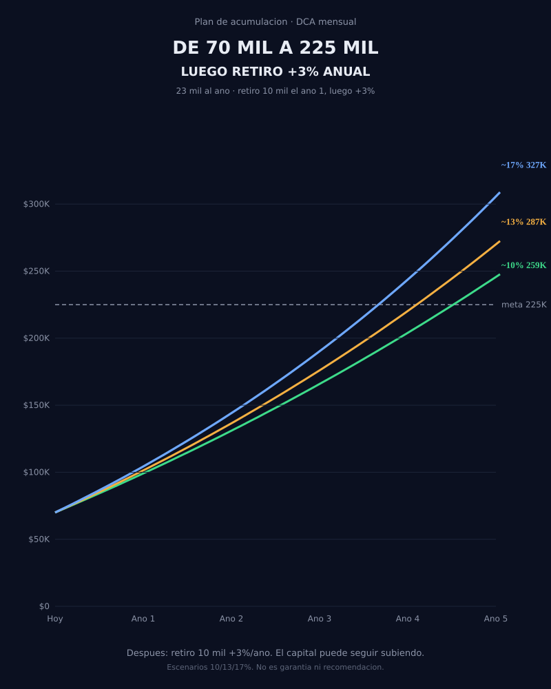

# De 70 mil a 225 mil en 5 años

Proyección de **DCA mensual** para un retiro parcial de **10 mil USD al año**.

Dos fases, un mismo portafolio:

1. **Acumular** (hoy → año 5): aportar 23 mil al año hasta cruzar 225 mil.
2. **Retirar y seguir creciendo** (año 5 en adelante): sacar 10 mil al año (~4%) y dejar el resto invertido.

No es un backtest histórico. Es una ilustración a 8% y 10% anual. El mercado no sube en línea recta.



PNG y GIF para redes: genera `acumulacion_70k_225k.png` y `.gif` con el script o el notebook.

## Fase 1 — llegar a 225 mil

| | |
|---|---|
| Capital inicial | 70.000 USD |
| Aporte | 23.000 USD / año (1.917 / mes) |
| Horizonte | 5 años |
| Meta | 225.000 USD |

| Escenario | Capital año 5 | ¿Llega a 225k? |
|---|---:|---|
| Solo aportes (0%) | 185.000 | No |
| ~8% | 242.664 | Sí |
| ~10% | 259.478 | Sí |

El ahorro solo no cierra la meta. El compuesto de 8–10% sí.

## Fase 2 — retirar 10 mil y no frenar el capital

Al cruzar 225 mil **dejan de ser obligatorios los 23 mil** y empiezan a salir **10 mil al año**.

La regla: si el portafolio rinde más que lo que retiras, el saldo sigue subiendo.

- Retiro: 10.000 / 225.000 = **4,4%** el primer año.
- Si rinde ~8%, quedan ~3,6 puntos de crecimiento neto.
- Si rinde ~10%, quedan ~5,6 puntos.

Ejemplo partiendo de **225 mil**, retiro fijo de 10 mil, **sin aportes nuevos**:

| Años retirando | Capital si rinde 8% | Capital si rinde 10% | Ya cobrado |
|---|---:|---:|---:|
| 0 (día 1) | 225.000 | 225.000 | 0 |
| 1 | 233.000 | 237.500 | 10.000 |
| 5 | 272.000 | 301.000 | 50.000 |
| 10 | 341.000 | 424.000 | 100.000 |

En diez años habrías cobrado **100 mil** y el portafolio, en esta ilustración, estaría **más grande que el día que empezaste a retirar**.

Eso es el retiro parcial: el capital trabaja; no se apaga.

Tres matices:

1. Un año malo al inicio del retiro duele más que en acumulación. Por eso se llega a 225 mil *antes* de vivir de él.
2. Si el gasto sube con inflación (~3%), el 4% se vuelve un poco más exigente. Aun así, un retorno de 8% deja margen.
3. Si el año 5 termina en 243–259 mil, esos 10 mil son ~4% o menos. Más colchón.

## Cómo correrlo

```bash
pip install -r requirements.txt
python simular_acumulacion_225k.py
```

Notebook: [Acumulacion_70k_225k.ipynb](Acumulacion_70k_225k.ipynb).

## Archivos

- `simular_acumulacion_225k.py` — PNG + GIF de la fase 1
- `Acumulacion_70k_225k.ipynb` — celdas paso a paso
- `acumulacion_70k_225k.svg` — gráfica del README

Paleta: [Retiro-portafolio](https://github.com/Andalejo1109/Retiro-portafolio).

## Disclaimer

Proyección ilustrativa. Rentabilidades pasadas no predicen resultados futuros. No es recomendación de inversión.
